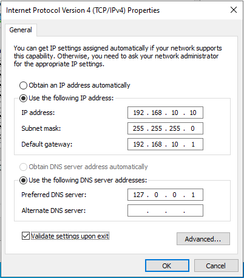

# 🌐 Windows Server 2022 - Static IP & Network Configuration

After completing the installation of Windows Server 2022, the first and most critical step is configuring a **Static IP address**.

---

## ❓ Why Do We Need a Static IP?
A server cannot rely on a dynamic (DHCP-assigned) IP address. Since this machine will provide services to other devices on the network, an IP address that changes automatically would cause clients to lose communication with the server.

---

## ⚙️ Configured IPv4 Settings & Values

In Windows, we navigated to **IPv4 Properties** via `ncpa.cpl` (Network Connections) and assigned the following static values:

---

## 💡 Concepts & Quick Explanations

### 1. IP Address & IP Ranges (`192.168.X.X`)
IP addresses are categorized into classes (A, B, C) and designated ranges based on network size:
* **`10.X.X.X`:** Reserved for massive enterprise networks and large organizations.
* **`172.16.X.X` - `172.31.X.X`:** Used for medium to large-scale networks.
* **`192.168.X.X`:** Designed for small networks, home setups, and small lab environments.

> We selected **`192.168.10.10`** for our local lab environment.

---

### 2. Subnet Mask
The Subnet Mask defines how many devices (hosts) can communicate within the same local network:
* **`255.255.255.0` (`/24`):** Allows up to **254** usable IP addresses. Ideal for small network setups.
* **`255.255.0.0` (`/16`):** Expands the network capacity to **over 65,000** usable host addresses.

---

### 3. Default Gateway — *The Home Address Analogy* 🏠
The Default Gateway is the exit door for local devices to access external networks (the Internet).

**💡 Example:** In an office or home, everyone has their own room or internal identifier (Local IP). However, when mail arrives or someone looks from the outside, everyone shares the **building's main door/street address** (Default Gateway / Public IP).

 Devices on a local network communicate with each other using local IPs, but whenever they need to reach the outside world, they forward traffic to the Gateway (`192.168.10.1`).

---

### 4. Preferred DNS Server
DNS acts as a phonebook that translates domain names into IP addresses.

We set the DNS address to **`127.0.0.1`** (Loopback - local host). This is because we will later install **Active Directory** and the **DNS Server** role directly on this Windows Server instance, requiring it to query itself for domain name resolutions.
