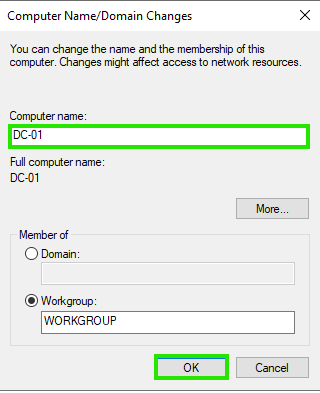
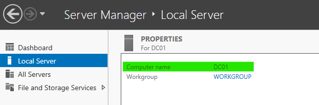

# 01. Hostname (Bilgisayar Adı) Değiştirme ve Ön Hazırlıklar

## 📌 Genel Bakış
Bu adımda, Windows Server kurulumu sonrasında otomatik olarak atanan karmaşık ve rastgele sunucu adını (`WIN-V3IN303QSAS` gibi) kurumsal adlandırma standartlarına (Naming Convention) uygun şekilde **DC01** olarak güncelledik.

---

## ❓ Server Adını Neye Göre Değiştiriyoruz? (Naming Convention)
Kurumsal IT altyapılarında sunucu isimleri rastgele bırakılmaz. Sunucu isimleri belirlenirken şu standartlar gözetilir:

* **Rol Tabanlı Adlandırma:** Sunucunun üstlendiği ana görevi ifade eder.
  * `DC` = Domain Controller (Kimlik Yönetimi Sunucusu)
  * `FS` = File Server (Dosya Paylaşım Sunucusu)
  * `EXCH` = Exchange Server (E-posta Sunucusu)
* **Sıra Numarası:** Aynı rolde birden fazla sunucu olabileceği için sonuna numara eklenir (`DC01`, `DC02`).
* **Lokasyon / Bölge Kodu (Opsiyonel):** Büyük yapılarda şehir veya veri merkezi kodu eklenir (Örn: `IST-DC01`).

### 🎯 Neden `DC01` Yaptık?
Bu sunucumuz **Dunder Mifflin** ortamının birincil **Domain Controller**'ı olacağı için rolünü ve birincil sunucu olduğunu belirten **DC01** ismini tercih ettik.

---

## 🛠️ Hostname Değiştirme Yöntemleri

### Yöntem 1: Server Manager (GUI / Arayüz) İle
1. **Server Manager** ekranında sol menüden **Local Server** sekmesine girilir.
2. **Computer name** alanındaki varsayılan isme (`WIN-XXXXX`) tıklanır.
3. Açılan **System Properties** penceresinde **Change...** butonuna basılır.
4. **Computer name** alanına **DC01** yazılarak **OK** butonuna basılır.
5. Değişikliğin uygulanması için sunucu yeniden başlatılır (Restart).


---

### Yöntem 2: PowerShell İle (Hızlı Yöntem)
Yönetici haklarıyla açılan PowerShell terminalinde tek bir komut çalıştırılarak isim değiştirilir ve sistem yeniden başlatılır:

```powershell
Rename-Computer -NewName "DC01" -Restart
```

## 🔍 Değişikliğin Doğrulanması
Sunucu yeniden başladıktan sonra PowerShell veya CMD terminalinde aşağıdaki komut çalıştırılarak yeni ismin geçerli olduğu doğrulanır:

```powershell
hostname
```

