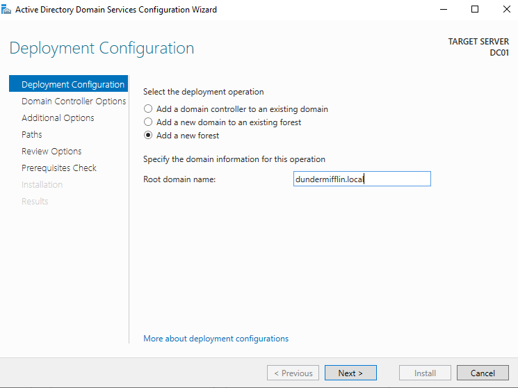
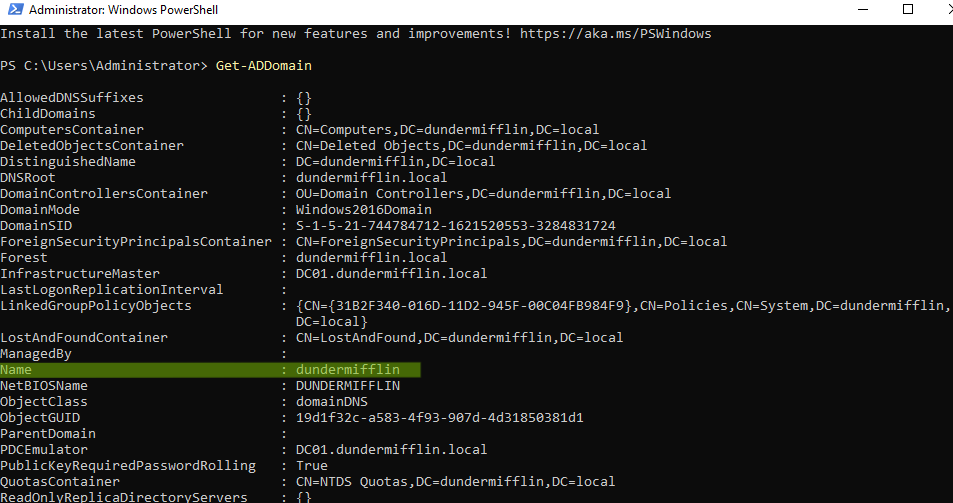

# 03. Domain Controller Yükseltme (Promote) & Forest Yapılandırması

## 📌 Genel Bakış
Bu adımda, AD DS rolü yüklenmiş olan Windows Server (DC01) sunucumuz resmen bir **Domain Controller** seviyesine yükseltilmiş ve `dundermifflin.local` adında yeni bir Active Directory Forest'ı (Orman) oluşturulmuştur.

---

## ❓ Ne Nedir? (Teknik Notlar & Örnekler)

### 1. Forest Kurulum Seçenekleri
Domain Controller yükseltme sihirbazındaki 3 temel seçenek ve kullanım senaryoları:

* **Add a new forest (Yeni bir forest ekle):**
  * **Ne Demek?** Ortamda hiç Active Directory yapısı yoksa sıfırdan ilk yapıyı kurar.
  * **Örnek:** Yeni kurulan bir şirkette veya tamamen sıfır bir lab ortamında (`dundermifflin.local`) ilk sunucuyu kurarken kullanılır. *(Biz bu seçeneği kullandık)*

* **Add a domain controller to an existing domain (Mevcut bir domaine yeni DC ekle):**
  * **Ne Demek?** Zaten kurulu olan bir domaine yedek/ikincil sunucu ekler.
  * **Örnek:** Ortamda `DC01` varken yüksek erişilebilirlik (yedeklilik) sağlamak için `DC02` sunucusunu eklerken kullanılır.

* **Add a new domain to an existing forest (Mevcut forest'a alt domain ekle):**
  * **Ne Demek?** Ana bir şirket yapısına bağlı alt bir şube/organizasyon oluşturur.
  * **Örnek:** Ana şirket `dundermifflin.local` iken Avrupa şubesi için `europe.dundermifflin.local` şeklinde alt domain (Child Domain) kurarken kullanılır.

---

### 2. DSRM (Directory Services Restore Mode) Parolası
* **Nedir?** Active Directory veritabanının bakım ve felaket kurtarma (Disaster Recovery) modudur.
* **Neden Önemli?** AD veritabanı bozulduğunda veya çöktüğünde sunucu Güvenli Mod benzeri DSRM modunda başlatılır. Bu modda varsayılan Domain Administrator şifresi çalışmaz, sadece kurulum sırasında belirlenen bu özel DSRM şifresi ile oturum açılabilir.

---

### 3. Otomatik Oluşturulan Dosyalar & Klasörler
AD DS yükseltme işlemi sırasında sistem tarafından kritik 3 yapı oluşturulur:

* **`NTDS` Klasörü (`NTDS.dit`):** Active Directory'nin asıl veritabanı dosyasıdır. Şirketteki tüm kullanıcılar, bilgisayarlar ve parola özetleri (hash) bu dosyada tutulur.
* **`NTDS Logs`:** Veritabanına yapılan işlemlerin kaydedildiği geçici günlük dosyalarıdır (Transaction Logs).
* **`SYSVOL` Klasörü:** Ağ üzerindeki tüm sunucu ve istemcilerle paylaşılan klasördür. Group Policy (GPO) ayarları ve oturum açma betikleri (Login Scripts) bu klasörde saklanır ve tüm DC'ler arasında eşitlenir (replicate edilir).

---

## 🛠 Kurulum Yöntemleri

### Yöntem 1: Server Manager (GUI) ile Yükseltme
1. Server Manager ekranındaki uyarı simgesinden **Promote this server to a domain controller** seçeneğine tıklanır.
2. Deployment Configuration ekranında **Add a new forest** seçilir ve Root domain adı `dundermifflin.local` olarak girilir.
3. Domain Controller Options ekranında DSRM parolası belirlenir (DNS ve Global Catalog seçili bırakılır).
4. NetBIOS alanı (`DUNDERMIFFLIN`) ve veritabanı yolları (`C:\Windows\NTDS`, `SYSVOL`) varsayılan haliyle onaylanır.
5. Ön gereksinim kontrolü (Prerequisites Check) sonrasında **Install** butonuna basılır ve işlem bitince sunucu otomatik olarak yeniden başlar.



---

### Yöntem 2: PowerShell ile Yükseltme (Hızlı Yöntem)
Yönetici haklarıyla açılan PowerShell terminalinde aşağıdaki komut çalıştırılarak yükseltme başlatılır:

```powershell
Import-Module ADDSDeployment
Install-ADDSForest `
    -CreateDnsDelegation:$false `
    -DatabasePath "C:\Windows\NTDS" `
    -DomainMode "WinThreshold" `
    -DomainName "dundermifflin.local" `
    -DomainNetbiosName "DUNDERMIFFLIN" `
    -ForestMode "WinThreshold" `
    -InstallDns:$true `
    -LogPath "C:\Windows\NTDS" `
    -SysvolPath "C:\Windows\SYSVOL" `
    -Force:$true
```
---

## 🔍 Değişikliğin Doğrulanması (Verification)
Sunucu yeniden başladıktan sonra oturum açma ekranında DUNDERMIFFLIN\Administrator ifadesi görülmelidir. Ardından PowerShell terminalinde şu komut çalıştırılarak doğrulanır:

```powershell
Get-ADDomain
```

